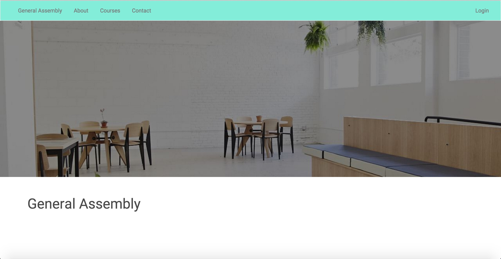

# Front End Engineering Challenge

Built a index page with a mobile responsive navbar utilizing bootstrap in the style as outlined in the Front End Engineering Challenge. 

## Technologies/Frameworks:

- HTML 5/CSS 3  
- Bootstrap    

## Styling

- Use the "Roboto" Google font   
- Use the following colors   
	- Page background: #FFFFFF    
	- Default/normal font color: #494949   
	- Navbar background: #83EDD9   
